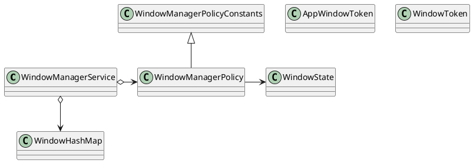

```plantuml
@startuml
class WindowManagerService
class WindowManagerPolicy
class WindowManagerPolicyConstants
class WindowState

class AppWindowToken
class WindowToken

WindowManagerService o-> WindowManagerPolicy
WindowManagerService o--> WindowHashMap
WindowManagerPolicyConstants <|-- WindowManagerPolicy
WindowManagerPolicy -> WindowState
@enduml
```
策略WindowManagerPolicy可以替换