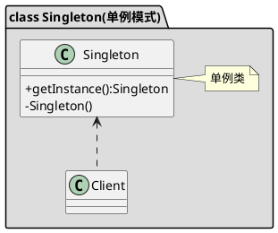

### **目标:**
保证一个类仅有一个实例,并提供一个访问它的全局访问点

### **实例：**
Android中的系统级服务都是通过容器的单例模式实现方式，以单例形式存在，减少了资源消耗。比如LayoutInflater Service，将这些服务以键值对的形式存储在一个HashMap容器中，用户使用时只需要根据key来获取到对应的ServiceFetcher，然后通过ServcieFetcher对象的getService函数来获取到具体的服务对象，第一次获取时会调用ServcieFetcher的createService函数创建服务对象，然后将该对象缓存到一个列表中，下次再取时直接从缓存中获取，避免重复创建对象，从而达到单例的效果。