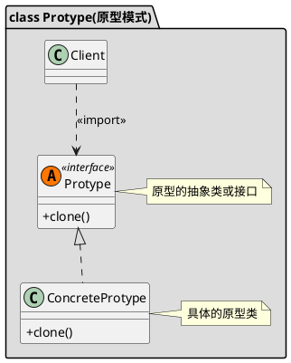

### **目标：**
用原型实例指定创建对象的种类，并且通过拷贝这个原型来创建新的对象。

## **实例：**
比如我们需要一张Bitmap的几种不同格式：ARGB_8888、RGB_565、ARGB_4444、ALAPHA_8等。那我们就可以先创建一个ARGB_8888的Bitmap作为原型，在它的基础上，通过调用Bitmap.copy(Config)来创建出其它几种格式的Bitmap。另外一个例子就是Java中所有对象都有的一个名字叫clone的方法，已经原型模式的代名词了。在系统中要创建大量的对象，这些对象之间具有几乎完全相同的功能，只是在细节上有一点儿差别。