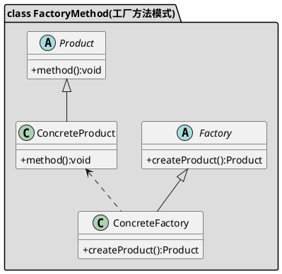

```plantuml
@startuml
skinparam classAttributeIconSize 0

package "class FactoryMethod(工厂方法模式)" #DDDDDD {
    abstract class Factory
    {
    +createProduct():Product
    }

    class ConcreteFactory
    {
    +createProduct():Product
    }

    abstract class Product
    {
    +method():void
    }

    class ConcreteProduct
    {
    +method():void
    }

    Product <|-- ConcreteProduct
    Factory <|-- ConcreteFactory
    ConcreteProduct <.. ConcreteFactory
}
@enduml
```

### **目标：**
定义一个用于创建对象的接口，让子类决定将哪一个类实例化。

### **实例：**
BitmapFactory位图工厂，专门用来将指定的图片转换为指定的位图Bitmap