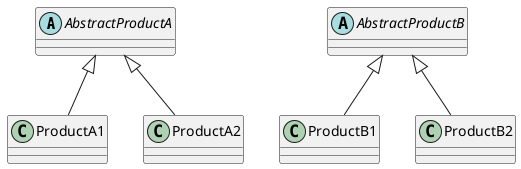
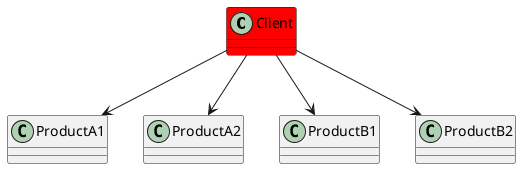
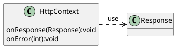
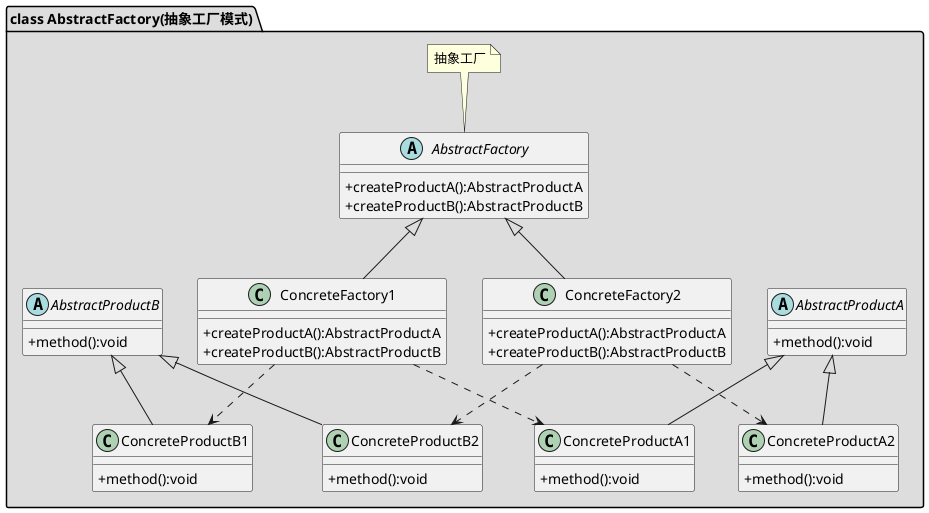
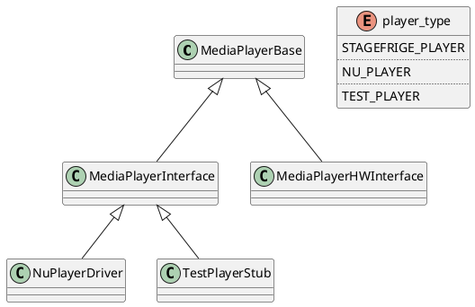
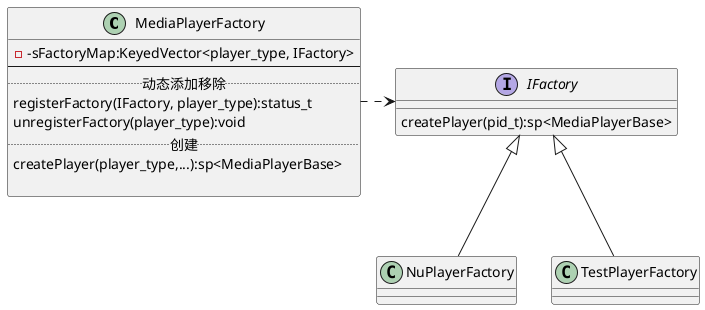

抽象工厂提供一个创建一系列相关或相互依赖对象的接口，而无需指定他们具体的类。



**关联**表示要深入了解内部实现细节



**以上使用时对具体对象的关联度太高**
抽象工厂用**依赖**减少**关联**


抽象工厂类图表示如下：

### **目标:**
提供一个创建一系列相关或相互依赖对象的接口，而无需指定它们具体的类。

### **实例**
Android底层对MediaPlayer的创建。
MediaPlayerFactory是Android底层为了创建不同的MediaPlayer所定义的一个类。

```
MediaPlayer p = new MediaPlayer();
p.setDataSource("test:invoke_mock_media_player.so?url=http://youtube.com");
p.prepare();
...
p.release();
```

---


```
void MediaPlayerFactory::registerBuiltinFactories() {
    Mutex::Autolock lock_(&sLock);

    if (sInitComplete)
        return;

    IFactory* factory = new NuPlayerFactory();
    if (registerFactory_l(factory, NU_PLAYER) != OK)
        delete factory;
    factory = new TestPlayerFactory();
    if (registerFactory_l(factory, TEST_PLAYER) != OK)
        delete factory;

    sInitComplete = true;
}
```