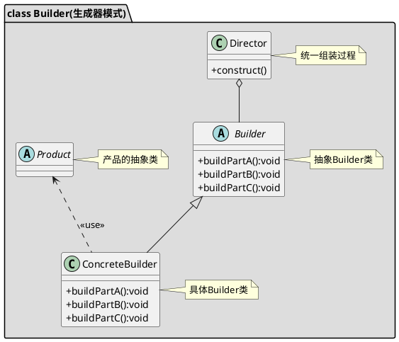

```plantuml
@startuml
skinparam classAttributeIconSize 0

package "class Builder(生成器模式)" #DDDDDD {
    abstract class Builder
    {
    +buildPartA():void
    +buildPartB():void
    +buildPartC():void
    }
    note right: 抽象Builder类

    class ConcreteBuilder
    {
    +buildPartA():void
    +buildPartB():void
    +buildPartC():void
    }
    note right: 具体Builder类

    class Director
    {
    +construct()
    }
    note right:统一组装过程

    abstract class Product
    note right:产品的抽象类

    Director o-- Builder
    Builder <|-- ConcreteBuilder
    Product <.. ConcreteBuilder:<<use>>
}
@enduml
```

### **目标：**
将一个复杂对象的构建与它的表示分离，使得同样的构建过程可以创建不同的表示。

### **实例：**
AlertDialog.Builder   ImageLoader的初始配置。