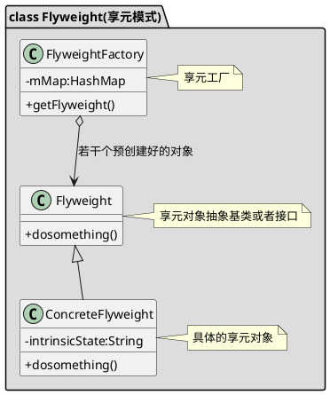

FlyWeight对象是真正要使用的对象，在FlyWeightFactory中预先创建了若干个FlyWeight对象，当外部要使用FlyWeight时不是创建一个新的对象，而是复用FlyWeight对象。

Android中常见的使用该模式的可参考线程池的实现，以及Handler中Message的obtain实现。

```java
    /**
     * Return a new Message instance from the global pool. Allows us to
     * avoid allocating new objects in many cases.
     */
    public static Message obtain() {
        synchronized (sPoolSync) {
            if (sPool != null) {
                Message m = sPool;
                sPool = m.next;
                m.next = null;
                m.flags = 0; // clear in-use flag
                sPoolSize--;
                return m;
            }
        }
        return new Message();
    }

    /**
     * Return a Message instance to the global pool.
     * <p>
     * You MUST NOT touch the Message after calling this function because it has
     * effectively been freed.  It is an error to recycle a message that is currently
     * enqueued or that is in the process of being delivered to a Handler.
     * </p>
     */
    public void recycle() {
        if (isInUse()) {
            if (gCheckRecycle) {
                throw new IllegalStateException("This message cannot be recycled because it "
                        + "is still in use.");
            }
            return;
        }
        recycleUnchecked();
    }

        /**
     * Recycles a Message that may be in-use.
     * Used internally by the MessageQueue and Looper when disposing of queued Messages.
     */
    void recycleUnchecked() {
        // Mark the message as in use while it remains in the recycled object pool.
        // Clear out all other details.
        flags = FLAG_IN_USE;
        what = 0;
        arg1 = 0;
        arg2 = 0;
        obj = null;
        replyTo = null;
        sendingUid = -1;
        when = 0;
        target = null;
        callback = null;
        data = null;

        synchronized (sPoolSync) {
            if (sPoolSize < MAX_POOL_SIZE) {
                next = sPool;
                sPool = this;
                sPoolSize++;
            }
        }
    }
```

```plantuml
class Message {
-sPool:Message
+obtian():Message
+recycle():void
}

Message o--> Message:通过recycle放入复用池中，通过obtain复用
```